# RFM Segmentation — eligibility and offer sizing in SQL


[](https://github.com/nhmTri/rfm-segmentation-sql/actions/workflows/sql-tests.yml)




Recency–Frequency–Monetary scoring on a retail customer base, written so that **every cut-off is a parameter** and the whole rule set re-runs on new data without editing logic.

**Champions spend 39% more at the same purchase frequency** — so the growth lever is basket size, not visit count.

---

## Why parameterised cut-offs matter

Hard-coded quintile boundaries rot the moment the base changes. Here the boundaries come from `NTILE` over the current base, and the segment rules read those scores — so re-running next quarter re-segments correctly instead of mislabelling everyone.

## The query

```
orders ──▶ customer_base ──▶ rfm_raw ──▶ rfm_scored ──▶ segments
           one row per      R, F, M      NTILE(5)      named rules
           customer         per customer  per metric    on the scores
```

`sql/rfm.sql` runs end to end. Swap the `params` CTE to change the window, the tier count, or the currency filter.

## Segments produced

| Segment | Rule | What to do with it |
|---|---|---|
| Champions | R 4–5, F 4–5, M 4–5 | Grow basket size, not visit frequency |
| Loyal | R 3–5, F 3–5 | Protect — cheapest revenue to keep |
| Potential | R 4–5, F 1–2 | Second-purchase nudge |
| At risk | R 1–2, F 3–5 | Win-back before the gap closes |
| Need attention | R 1–2, F 1–2, M 1–2 | Engage too little for discounts to land — build trust, not price cuts |

## Run it

```bash
make run     # load the synthetic sample, print the segments
make test    # run the query and diff against tests/expected_segments.csv
```

Or directly:

```bash
psql -f sql/00_sample_data.sql
psql -f sql/rfm.sql
```

Window functions only, no vendor extensions — it ports to BigQuery, MySQL 8 and SQL Server with minimal changes.

Every push runs the query against a real PostgreSQL 16 in GitHub Actions and diffs the result against `tests/expected_segments.csv`. If the logic drifts, the badge above goes red. Data provenance: [`data/README.md`](data/README.md).

---

**Stack** · SQL (CTEs, window functions) · Power BI
**More** · [live SQL console on my portfolio](https://portfolionhmtri.netlify.app)
